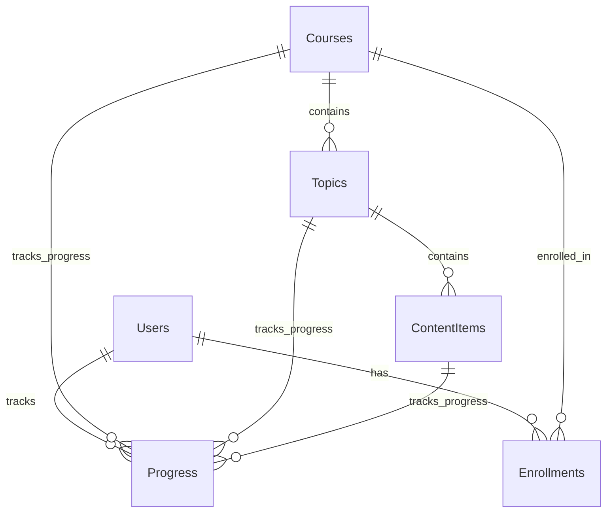

# Developer Guide - SimpleLMS

Comprehensive technical documentation for developers working on SimpleLMS.

## 🏗️ Architecture Overview

### Technology Stack
- **Backend**: ASP.NET Core 8.0 (MVC + Razor Pages)
- **Database**: SQLite with Entity Framework Core
- **Authentication**: ASP.NET Core Identity
- **Frontend**: Razor Views with Tailwind CSS
- **Content Processing**: Markdig for Markdown rendering

### Architecture Patterns
- **MVC Pattern**: Controllers handle business logic, Views handle presentation
- **Repository Pattern**: Entity Framework Core provides data access
- **Dependency Injection**: Built-in ASP.NET Core DI container
- **Razor Pages**: For Identity and simple CRUD operations

## 📁 Project Structure Deep Dive

### Controllers Layer
```
Controllers/
├── AdminController.cs          # Admin panel functionality
├── ContentItemController.cs    # Content item CRUD operations
├── CoursesController.cs        # Course listing and enrollment
├── DashboardController.cs      # User dashboard logic
├── HomeController.cs          # Home page controller
└── TopicController.cs         # Topic management
```

### Models Layer
```
Models/
├── Course.cs                  # Main course entity
├── Topic.cs                   # Course topics/chapters
├── ContentItem.cs             # Individual content pieces
├── Enrollment.cs              # User course enrollments
├── Progress.cs                # User progress tracking
├── ContentType.cs             # Content type enumeration
├── ProgressStatus.cs          # Progress status enumeration
└── ViewModels/                # View-specific models
    └── DashboardViewModel.cs  # Dashboard data model
```

### Data Layer
```
Data/
├── ApplicationDbContext.cs    # EF Core DbContext
└── Migrations/               # Database migrations
    ├── InitialCreate.cs
    └── ...
```

## 🔧 Key Components

### 1. ApplicationDbContext
```csharp
public class ApplicationDbContext : IdentityDbContext
{
    public DbSet<Course> Courses { get; set; }
    public DbSet<Topic> Topics { get; set; }
    public DbSet<ContentItem> ContentItems { get; set; }
    public DbSet<Enrollment> Enrollments { get; set; }
    public DbSet<Progress> Progresses { get; set; }
}
```

### 2. Course Entity
```csharp
public class Course
{
    public int Id { get; set; }
    public string Title { get; set; }
    public string Description { get; set; }
    public ContentType ContentType { get; set; }
    public string Content { get; set; }
    public string? VideoUrl { get; set; }
    public string? PdfFilePath { get; set; }
    public List<Topic> Topics { get; set; }
    public List<Enrollment> Enrollments { get; set; }
}
```

### 3. Content Types
```csharp
public enum ContentType
{
    Text = 0,    // Markdown content
    Pdf = 1,     // PDF files
    Video = 2    // YouTube videos
}
```

## 🎯 Core Features Implementation

### 1. Course Management

#### Course Creation Flow
1. **AdminController.Create()**: Handles course creation
2. **File Upload**: PDF files stored in `wwwroot/uploads/pdfs/`
3. **YouTube Integration**: Automatic URL conversion to embed format
4. **Content Path Generation**: Auto-generates SEO-friendly URLs

#### Key Methods
```csharp
// Course creation with file upload
[HttpPost]
public async Task<IActionResult> Create([Bind("...")] Course course, IFormFile? pdfFile)
{
    if (course.ContentType == ContentType.Pdf && pdfFile != null)
    {
        // Handle PDF upload
        var uniqueFileName = Guid.NewGuid().ToString() + "_" + pdfFile.FileName;
        // Save file and update course.PdfFilePath
    }
    
    if (course.ContentType == ContentType.Video && !string.IsNullOrEmpty(course.VideoUrl))
    {
        // Convert YouTube URL to embed format
        course.VideoUrl = ConvertToEmbedUrl(course.VideoUrl);
    }
}
```

### 2. User Authentication

#### Identity Configuration
```csharp
// Program.cs
builder.Services.AddDefaultIdentity<IdentityUser>(options => 
    options.SignIn.RequireConfirmedAccount = true)
    .AddEntityFrameworkStores<ApplicationDbContext>();
```

#### Email Confirmation
- Users must confirm email before login
- Custom confirmation pages with beautiful UI
- Secure token-based verification

### 3. Progress Tracking

#### Progress Entity
```csharp
public class Progress
{
    public int Id { get; set; }
    public string UserId { get; set; }
    public int CourseId { get; set; }
    public int? TopicId { get; set; }
    public int? ContentItemId { get; set; }
    public ProgressStatus Status { get; set; }
}
```

#### Progress Calculation
```csharp
// Calculate completion percentage
var totalContentItems = course.Topics.Sum(t => t.ContentItems.Count);
var completedItems = progress.Count(p => p.Status == ProgressStatus.Complete);
var completionRate = (double)completedItems / totalContentItems * 100;
```

## 🎨 UI/UX Implementation

### 1. Tailwind CSS Integration

#### Configuration
- **CDN**: Tailwind CSS loaded via CDN for simplicity
- **Custom Styles**: `wwwroot/css/site.css` for custom styles
- **Responsive Design**: Mobile-first approach

#### Key Design Patterns
```css
/* Glassmorphism effect */
.glass-effect {
    @apply bg-white/10 backdrop-blur-xl border border-white/20;
}

/* Gradient backgrounds */
.gradient-primary {
    @apply bg-gradient-to-r from-indigo-600 to-purple-600;
}

/* Hover animations */
.hover-scale {
    @apply hover:scale-105 transition-all duration-300;
}
```

### 2. Component Structure

#### Layout Components
- **`_Layout.cshtml`**: Main layout with navigation
- **`_LoginPartial.cshtml`**: Authentication links
- **`_ValidationScriptsPartial.cshtml`**: Client-side validation

#### Page Components
- **Dashboard**: Statistics cards, course lists
- **Course Details**: Topic structure, content display
- **Admin Panel**: CRUD interfaces for course management

### 3. JavaScript Integration

#### Mobile Menu
```javascript
document.addEventListener('DOMContentLoaded', function() {
    const mobileMenuButton = document.getElementById('mobile-menu-button');
    const mobileMenu = document.getElementById('mobile-menu');
    
    mobileMenuButton.addEventListener('click', function() {
        mobileMenu.classList.toggle('hidden');
    });
});
```

#### Dynamic Content Fields
```javascript
// Show/hide content fields based on content type
contentTypeSelect.addEventListener('change', function() {
    const selectedValue = this.value;
    contentFields.forEach(field => field.classList.add('hidden'));
    
    if (selectedValue === '0') { // Text
        document.getElementById('textContent').classList.remove('hidden');
    } else if (selectedValue === '1') { // Pdf
        document.getElementById('pdfContent').classList.remove('hidden');
    } else if (selectedValue === '2') { // Video
        document.getElementById('videoContent').classList.remove('hidden');
    }
});
```

## 🔒 Security Implementation

### 1. Authentication & Authorization

#### Identity Configuration
```csharp
// Program.cs
builder.Services.AddDefaultIdentity<IdentityUser>(options => {
    options.SignIn.RequireConfirmedAccount = true;
    options.Password.RequireDigit = true;
    options.Password.RequireLowercase = true;
    options.Password.RequireUppercase = true;
    options.Password.RequireNonAlphanumeric = true;
    options.Password.RequiredLength = 6;
})
```

#### Authorization
```csharp
// Admin-only actions
[Authorize(Roles = "Admin")]
public class AdminController : Controller
{
    // Admin functionality
}
```

### 2. File Upload Security

#### Validation
```csharp
// File type validation
if (pdfFile != null && pdfFile.Length > 0)
{
    var allowedExtensions = new[] { ".pdf" };
    var fileExtension = Path.GetExtension(pdfFile.FileName);
    
    if (!allowedExtensions.Contains(fileExtension.ToLower()))
    {
        ModelState.AddModelError("", "Only PDF files are allowed.");
        return View(course);
    }
}
```

#### Secure File Storage
```csharp
// Unique file naming
var uniqueFileName = Guid.NewGuid().ToString() + "_" + pdfFile.FileName;
var filePath = Path.Combine(uploadsFolder, uniqueFileName);

// Secure file saving
using (var fileStream = new FileStream(filePath, FileMode.Create))
{
    await pdfFile.CopyToAsync(fileStream);
}
```

## 📊 Database Design

### 1. Entity Relationships



### 2. Key Tables

#### Courses Table
```sql
CREATE TABLE Courses (
    Id INTEGER PRIMARY KEY,
    Title TEXT NOT NULL,
    Description TEXT,
    ContentType INTEGER NOT NULL,
    Content TEXT,
    VideoUrl TEXT,
    PdfFilePath TEXT,
    Instructor TEXT,
    Duration INTEGER,
    Level TEXT,
    Price REAL,
    ImageUrl TEXT,
    CreatedAt TEXT NOT NULL,
    IsActive INTEGER NOT NULL
);
```

#### Topics Table
```sql
CREATE TABLE Topics (
    Id INTEGER PRIMARY KEY,
    Title TEXT NOT NULL,
    Description TEXT,
    CourseId INTEGER NOT NULL,
    Order INTEGER NOT NULL,
    CreatedAt TEXT NOT NULL,
    IsActive INTEGER NOT NULL,
    FOREIGN KEY (CourseId) REFERENCES Courses(Id)
);
```

## 🧪 Testing Strategy

### 1. Manual Testing Checklist

#### User Flow Testing
- [ ] User registration and email confirmation
- [ ] User login and logout
- [ ] Course browsing and enrollment
- [ ] Content consumption and progress tracking
- [ ] Dashboard functionality

#### Admin Flow Testing
- [ ] Course creation with different content types
- [ ] Topic and content item management
- [ ] File upload functionality
- [ ] YouTube URL conversion

#### UI/UX Testing
- [ ] Responsive design on different screen sizes
- [ ] Form validation and error handling
- [ ] Navigation and user flow
- [ ] Accessibility features

### 2. Automated Testing (Future)

#### Unit Tests
```csharp
[Test]
public void CourseCreation_WithValidData_ShouldSucceed()
{
    // Arrange
    var course = new Course { Title = "Test Course", Description = "Test" };
    
    // Act
    var result = _courseService.CreateCourse(course);
    
    // Assert
    Assert.IsTrue(result.Success);
}
```

#### Integration Tests
```csharp
[Test]
public async Task CourseController_Create_ShouldReturnRedirect()
{
    // Arrange
    var course = new Course { Title = "Test Course" };
    
    // Act
    var result = await _controller.Create(course);
    
    // Assert
    Assert.IsInstanceOf<RedirectToActionResult>(result);
}
```

## 🚀 Performance Optimization

### 1. Database Optimization

#### Eager Loading
```csharp
// Include related data to avoid N+1 queries
var course = await _context.Courses
    .Include(c => c.Topics.OrderBy(t => t.Order))
        .ThenInclude(t => t.ContentItems.OrderBy(ci => ci.Order))
    .FirstOrDefaultAsync(m => m.Id == id);
```

#### Indexing Strategy
```sql
-- Add indexes for frequently queried columns
CREATE INDEX IX_Courses_IsActive ON Courses(IsActive);
CREATE INDEX IX_Enrollments_UserId ON Enrollments(UserId);
CREATE INDEX IX_Progress_UserId_CourseId ON Progress(UserId, CourseId);
```

### 2. Caching Strategy

#### Memory Caching
```csharp
// Cache frequently accessed data
builder.Services.AddMemoryCache();

// In controller
var courses = await _cache.GetOrCreateAsync("popular_courses", async entry => {
    entry.SlidingExpiration = TimeSpan.FromMinutes(10);
    return await _context.Courses.Where(c => c.IsActive).ToListAsync();
});
```

### 3. File Optimization

#### Image Optimization
- Use WebP format for images
- Implement lazy loading
- Compress images appropriately

#### CSS/JS Optimization
- Minify CSS and JavaScript in production
- Use CDN for external libraries
- Implement critical CSS loading

## 🔧 Configuration Management

### 1. Environment-Specific Settings

#### Development
```json
{
  "ConnectionStrings": {
    "DefaultConnection": "DataSource=app.db;Cache=Shared"
  },
  "Logging": {
    "LogLevel": {
      "Default": "Information",
      "Microsoft.AspNetCore": "Warning"
    }
  }
}
```

#### Production
```json
{
  "ConnectionStrings": {
    "DefaultConnection": "Server=prod-server;Database=SimpleLMS;..."
  },
  "Logging": {
    "LogLevel": {
      "Default": "Warning",
      "Microsoft.AspNetCore": "Error"
    }
  }
}
```

### 2. Feature Flags

```csharp
// Program.cs
builder.Services.AddFeatureManagement();

// In controller
[FeatureGate("EmailConfirmation")]
public async Task<IActionResult> ConfirmEmail(string userId, string code)
{
    // Email confirmation logic
}
```

## 📈 Monitoring & Logging

### 1. Logging Configuration

```csharp
// Program.cs
builder.Logging.AddConsole();
builder.Logging.AddDebug();

// In controllers
_logger.LogInformation("User {UserId} enrolled in course {CourseId}", userId, courseId);
_logger.LogWarning("Failed to process payment for user {UserId}", userId);
_logger.LogError(ex, "Error occurred while creating course");
```

### 2. Health Checks

```csharp
// Program.cs
builder.Services.AddHealthChecks()
    .AddDbContextCheck<ApplicationDbContext>();

// In middleware
app.MapHealthChecks("/health");
```

## 🔄 Deployment Pipeline

### 1. Build Process

```bash
# Build for production
dotnet publish -c Release -o ./publish

# Create Docker image
docker build -t simplelms .

# Run container
docker run -p 8080:80 simplelms
```

### 2. Database Migrations

```bash
# Apply migrations in production
dotnet ef database update

# Rollback if needed
dotnet ef database update PreviousMigrationName
```

### 3. Environment Variables

```bash
# Set production environment
export ASPNETCORE_ENVIRONMENT=Production
export ConnectionStrings__DefaultConnection="Server=prod-server;Database=SimpleLMS;..."

# Run application
dotnet SimpleLMS.dll
```

## 🤝 Contributing Guidelines

### 1. Code Style

#### C# Conventions
- Use PascalCase for public members
- Use camelCase for private fields
- Use meaningful variable names
- Add XML documentation for public APIs

#### Razor Conventions
- Use PascalCase for model properties
- Use kebab-case for CSS classes
- Keep views focused and simple
- Use partial views for reusable components

### 2. Git Workflow

```bash
# Create feature branch
git checkout -b feature/new-feature

# Make changes and commit
git add .
git commit -m "Add new feature with detailed description"

# Push and create PR
git push origin feature/new-feature
```

### 3. Pull Request Guidelines

- **Title**: Clear, descriptive title
- **Description**: Detailed explanation of changes
- **Testing**: Include test results
- **Screenshots**: For UI changes
- **Breaking Changes**: Clearly document any breaking changes

## 📚 Additional Resources

### 1. ASP.NET Core Documentation
- [Official Documentation](https://docs.microsoft.com/en-us/aspnet/core/)
- [Entity Framework Core](https://docs.microsoft.com/en-us/ef/core/)
- [ASP.NET Core Identity](https://docs.microsoft.com/en-us/aspnet/core/security/authentication/identity)

### 2. Frontend Resources
- [Tailwind CSS Documentation](https://tailwindcss.com/docs)
- [Razor Syntax](https://docs.microsoft.com/en-us/aspnet/core/mvc/views/razor)

### 3. Database Resources
- [SQLite Documentation](https://www.sqlite.org/docs.html)
- [Entity Framework Core](https://docs.microsoft.com/en-us/ef/core/)

---

**Happy Developing! 🚀** 